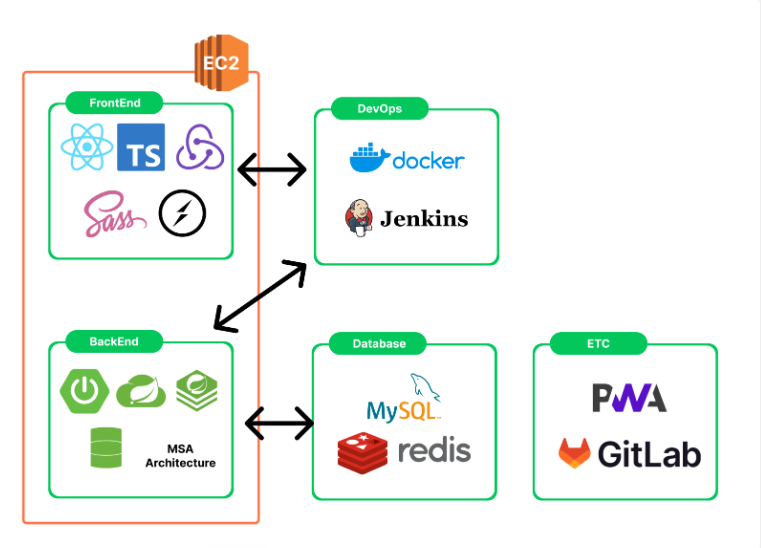
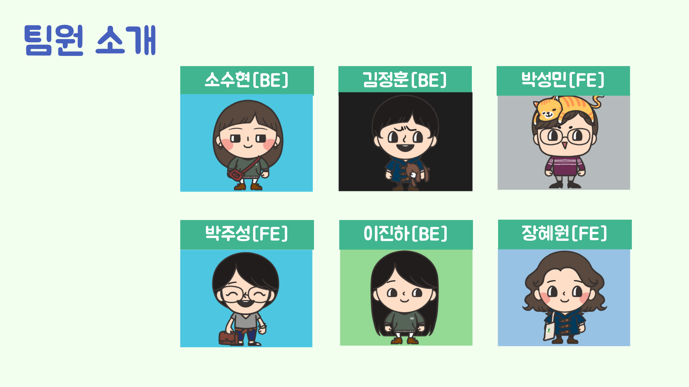

# 🌎플로닛(PloNit)🌎

프로젝트 기간: 2023.10.09 ~ 2023.11.17

# 서비스 소개

지구와 나를 가꾸는 플랫폼 플로닛(PloNit)

플로깅은 줍다(POLCKA UPP)과 조깅(JOGGING)이 합쳐진 단어로 조깅을 하면서 쓰레기를 주워 환경 정화와 운동효과를 동시에 얻을 수 있는 활동입니다.

플로닛 서비스는 이러한 플로깅을 더욱 편리하고 즐겁게 할 수 있도록 하는 서비스를 제공합니다.

## 서비스 특징

1. 실시간 GPS 연동으로 플로깅을 하는 동안 경로를 저장하여 기록으로 남길 수 있습니다.
2. 크루에 가입하여 커뮤니티 활동 및 크루핑(단체 플로깅)을 할 수 있습니다.
3. 1365와 연계하여 봉사활동시간을 얻는데 사용할 수 있습니다.

## 주요 기능

#### 플로깅 기능

- 플로깅은 개인, 봉사, 크루 3종류가 있습니다.
- 플로깅 시작시 실시간 GPS 연동으로 사용자의 좌표를 저장하여 기록합니다.
- 플로깅 입장 시 플로깅 중인 주변유저를 확인할 수 있습니다.
- 버튼 클릭으로 플로깅 도중 휴지통이나 화장실의 위치를 알 수 있습니다.
- 플로깅 도중 칼로리, 거리, 시간을 실시간으로 확인할 수 있습니다.
- 플로깅 도중 사진을 찍을 수 있고 영역을 지정하여 저장할 수 있습니다.
- 플로깅 시 주변에 도움을 요청할 수 있습니다.
- 봉사 플로깅시 봉사 활동 시간 반영에 필요한 정보를 저장하여 1365 봉사시간을 받을 수 있습니다.
- 크루 플로깅시 다른 유저와 함께 플로깅이 가능하고 함께하는 크루핑원의 실시간 위치를 확인할 수 있습니다.

#### 커뮤니티 기능

- 크루를 만들어 크루원들과 소식을 공유하고 크루핑을 생성할 수 있습니다.
- 사용자는 원하는 크루에 가입요청을 보낼 수 있다.
- 크루장은 대기중인 사용자의 가입을 승인하거나 거절할 수 있다.
- 크루장은 크루원을 강퇴시킬 수 있다.
- 크루원은 가입한 크루에서 탈퇴할 수 있다.
- 크루 안에서 피드를 작성하고 삭제할 수 있습니다.
- 피드를 좋아요 및 좋아요 취소가 가능하다.
- 피드에 댓글을 작성하고 삭제할 수 있다.
- 크루안에서 크루원들과 플로깅하기 위한 크루핑을 생성할 수 있다.
- 크루원들은 생성된 크루핑에 참가하거나 참가 취소할 수 있다.
- 크루핑장은 크루핑원을 강퇴시킬 수 있다.

#### 랭킹 및 뱃지 기능

- 개인 랭킹 및 크루 랭킹을 운영하고 뱃지 부여를 통해 지속적인 참여를 유도할 수 있습니다.
- 랭킹은 개인, 크루 전체, 크루 평균 3가지가 운영됩니다.
- 뱃지는 미션뱃지, 랭킹 뱃지로 나눠져 있어 미션은 거리 또는 시간 달성시 부여되고 랭킹은 해당 시즌 1,2,3등에게 부여됩니다.

# 기능별 화면

## 시스템 아키텍처



## ERD 다이어그램


## 문서 링크

### 1. [와이어프레임](https://www.figma.com/file/7fSuW2fu7sQGii8gQBZO7H/%EC%9E%90%EC%9C%A8?type=design&node-id=0-1&mode=design&t=m3IWYwK7O8R0jHyH-0)

### 2. [기능명세서](https://www.notion.so/a2321dd15d11450792d746ae784d8f9e)

### 3. [API명세서](https://www.notion.so/API-e210258a3ade4ec0a244b35c3cfbabe3)

## Git-flow

## commit-convention

```javascript
[커밋타입] - 작업내용_한눈에_알아보게_적기_최대한_자세하게
ex)[INIT](띄어쓰기) 초기화
- INIT: 초기화
- FEAT: 새로운 기능을 추가할 경우
- MODIFY: 코드를 수정한 경우
- STYLE: 기능에 영향을 주지 않는 커밋, 코드 순서, CSS등의 포맷에 관한 커밋
- FIX: 버그를 고친 경우
- REFACTOR: 프로덕션 코드 리팩토링
- TEST: 테스트 코드 작성
- DOCS: main 문서를 수정한 경우, readme, log 등
- REVIEW: 코드 리뷰 반영
- BUILD: 빌드 변경
- BACKUP: 백업
- COMMENT : 주석
- FILE: 파일 삭제, 추가, 수정을 수행하는 경우
- MERGE: 충돌 시 머지, develop 브랜치에 풀리퀘 등
- CHORE: 위에 해당되지 않는 나머지 (기타 등등)
```

## 팀원 소개


