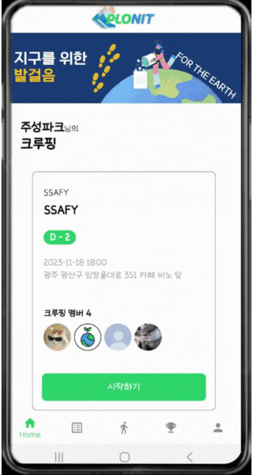
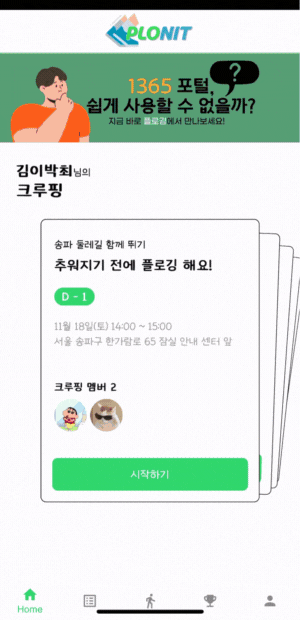
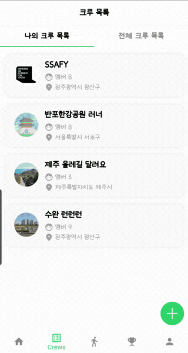
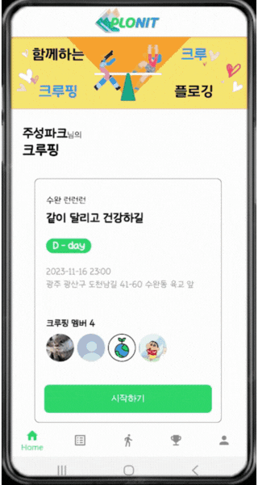
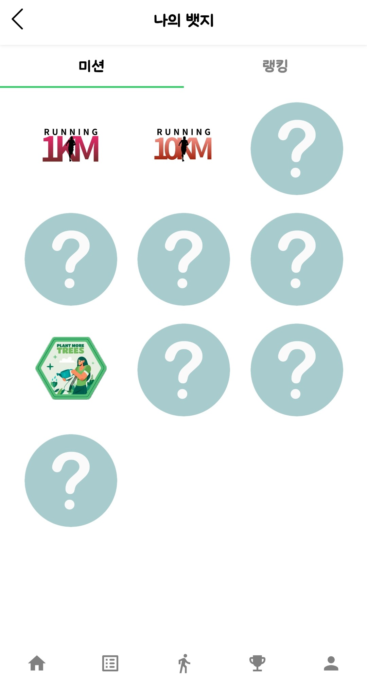
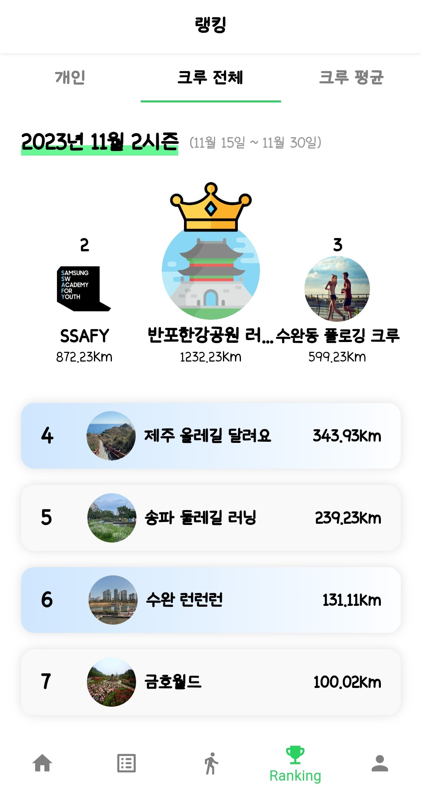
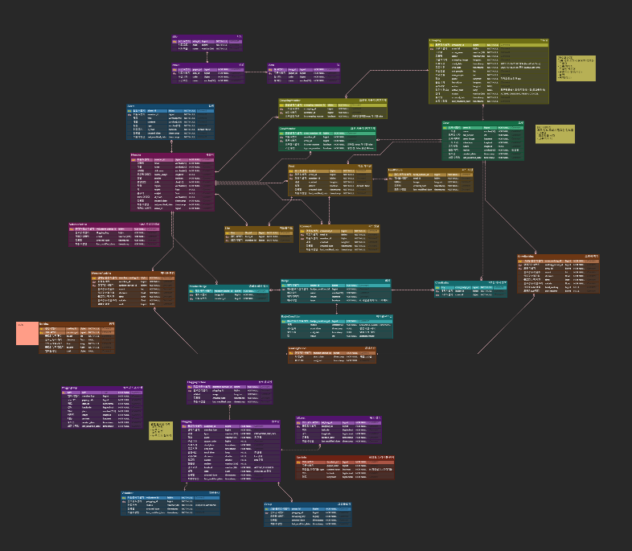

# 🌎플로닛(PloNit)🌎

### 🕓개발 기간

개발 기간: 2023.10.09 ~ 2023.11.17

### ✨팀원 소개

| 팀원 | 역할 |
| --- | --- |
| 소수현 | 팀장, BE |
| 김정훈 | BE |
| 박성민 | FE |
| 박주성 | FE |
| 이진하 | BE, INFRA |
| 장혜원 | FE |

# 서비스 소개

지구와 나를 가꾸는 플랫폼 플로닛(PloNit)

플로깅은 줍다(POLCKA UPP)과 조깅(JOGGING)이 합쳐진 단어로 조깅을 하면서 쓰레기를 주워 환경 정화와 운동효과를 동시에 얻을 수 있는 활동입니다.

플로닛 서비스는 이러한 플로깅을 더욱 편리하고 즐겁게 할 수 있도록 하는 서비스를 제공합니다.

## 서비스 특징

1. 실시간 GPS 연동으로 플로깅을 하는 동안 경로를 저장하여 기록으로 남길 수 있습니다.
2. 크루에 가입하여 커뮤니티 활동 및 크루핑(단체 플로깅)을 할 수 있습니다.
3. 1365와 연계하여 봉사활동시간을 얻는데 사용할 수 있습니다.

## 서비스 기능

1. 플로깅
    1. 개인(공통)
        - 플로깅 시작 시 실시간 GPS 연동으로 사용자의 좌표를 저장하여 기록한다.
        - 플로깅 입장 시 플로깅 중인 주변 유저를 확인할 수 있다.
        - 화장실 아이콘, 쓰레기통 아이콘을 클릭해 플로깅 도중 휴지통과 화장실의 위치를 알 수 있다.
        - 플로깅 도중 소모 칼로리, 이동 거리, 소요 시간을 실시간으로 확인할 수 있다.
        - 플로깅 도중 사진을 찍을 수 있고, 크롭 기능을 이용해 영역을 지정해 저장할 수 있다.
        - 플로깅 시 주변에 도움을 요청할 수 있다.

        
        
    2. 봉사
        - 1365 아이디, 생년월일 등의 봉사 정보를 추가로 입력할 수 있다.
        - 플로깅 시작 사진, 플로깅 중간 사진, 플로깅 종료 사진을 촬영해 봉사 인증을 할 수 있다.
        - 매주 월요일 오전 9시, 저번 주의 봉사 플로깅 정보를 엑셀 파일로 생성해 봉사 담당자 메일로 전송한다. (자동화)
        
        
        
    3. 크루
        - 크루 내에서 크루 플로깅(크루핑)을 생성 및 참가할 수 있다.
        - 대기화면에서 어떤 유저가 참가하고 나가는지 알 수 있다.
        - 크루핑장은 크루핑의 시작과 종료를 결정할 수 있다.
        - 크루핑원은 크루핑 종료는 스스로 결정할 수 있다.
        - 크루핑 시 다른 유저와 함께 플로깅이 가능하고 함께하는 크루핑원의 실시간 위치를 확인할 수 있다.
        
        
        
    4. 플로깅 기록
        - 달력에서 날짜를 선택해 참여한 플로깅 기록을 조회할 수 있다.
        - 플로깅 기록을 선택해 참여 날짜, 장소, 소요 시간, 소모 칼로리,  트래킹 경로, 사진 등을 조회할 수 있다.
        
        
        
2. 크루
    1. 커뮤니티
        - 피드
            - 크루를 만들어 크루원들과 소식을 공유하고 크루핑을 생성할 수 있다.
            - 크루 안에서 피드를 작성하고 삭제할 수 있습니다.
        - 좋아요
            - 피드를 좋아요 및 좋아요 취소가 가능하다.
        - 댓글
            - 피드에 댓글을 작성하고 삭제할 수 있다.
    2. 기타
        - 공통
            - 크루안에서 크루원들과 플로깅하기 위한 크루핑을 생성하고 참가할 수 있다.
            - 크루핑장은 크루핑원을 강퇴시킬 수 있다.
        - 크루장
            - 크루장은 대기중인 사용자의 가입을 승인하거나 거절할 수 있다.
            - 크루장은 크루원을 강퇴시킬 수 있다.
        - 크루원
            - 사용자는 원하는 크루에 가입요청을 보낼 수 있다.
            - 크루원은 가입한 크루에서 탈퇴할 수 있다.

        

        

1. 랭킹 & 뱃지 ( 랭킹 사진 + 뱃지 사진)
    1. 개인랭킹
        - 사용자가 참여한 플로깅의 총 거리로 개인 랭킹을 나타낼 수 있다.
    2. 개인뱃지
        - 뱃지는 미션배지와 랭킹 뱃지로 구분할 수 있다.
        - 거리 또는 횟수 달성에 따라 미션 뱃지를 획득할 수 있다.
        - 해당 시즌 1,2,3위는 랭킹 뱃지를 획득할 수 있다.
    3. 크루랭킹
        - 크루 랭킹은 전체 랭킹과 평균 랭킹으로 구분할 수 있다.
        - 해당 크루의 모든 크루원의 플로깅  총 거리로 크루 전체 랭킹을 나타낼 수 있다.
        - 해당 크루의 플로깅  총 거리 / 총 크루원 으로 크루 평균 랭킹을 나타낼 수 있다.
    4. 크루뱃지
        - 해당 시즌 1,2,3위는 랭킹 뱃지를 획득할 수 있다.

        

        

## 기술 스택

### MSA

### Spring Scheduler

### Spring Batch

### WebSocket


## 시스템 아키텍처


## ERD 다이어그램



## 문서 링크

### 1. [와이어프레임](https://www.figma.com/file/7fSuW2fu7sQGii8gQBZO7H/%EC%9E%90%EC%9C%A8?type=design&node-id=0-1&mode=design&t=m3IWYwK7O8R0jHyH-0)

### 2. [기능명세서](https://www.notion.so/a2321dd15d11450792d746ae784d8f9e)

### 3. [API명세서](https://www.notion.so/API-e210258a3ade4ec0a244b35c3cfbabe3)

### 4. [ERD](https://www.erdcloud.com/d/mvHZaHu2kP7id5mmB)            

## commit-convention

```javascript
[커밋타입] - 작업내용_한눈에_알아보게_적기_최대한_자세하게
ex)[INIT](띄어쓰기) 초기화
- INIT: 초기화
- FEAT: 새로운 기능을 추가할 경우
- MODIFY: 코드를 수정한 경우
- STYLE: 기능에 영향을 주지 않는 커밋, 코드 순서, CSS등의 포맷에 관한 커밋
- FIX: 버그를 고친 경우
- REFACTOR: 프로덕션 코드 리팩토링
- TEST: 테스트 코드 작성
- DOCS: main 문서를 수정한 경우, readme, log 등
- REVIEW: 코드 리뷰 반영
- BUILD: 빌드 변경
- BACKUP: 백업
- COMMENT : 주석
- FILE: 파일 삭제, 추가, 수정을 수행하는 경우
- MERGE: 충돌 시 머지, develop 브랜치에 풀리퀘 등
- CHORE: 위에 해당되지 않는 나머지 (기타 등등)
```

## 팀원 소개


